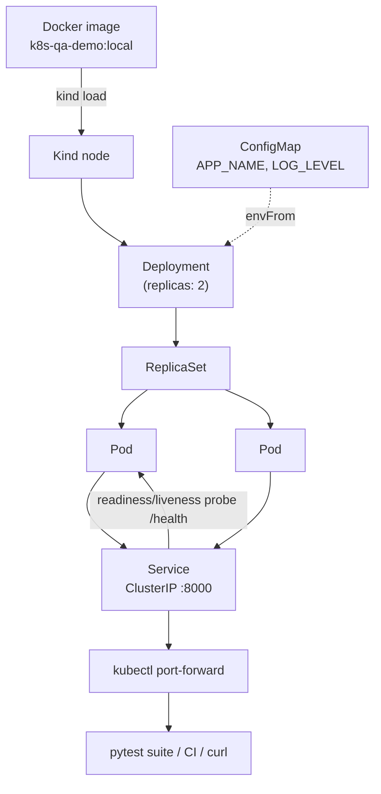

# k8s-qa-demo


A small FastAPI service deployed to Kubernetes (Kind), tested with pytest, and automated end-to-end in GitHub Actions. Built from a **QA-automation** perspective: the interesting part isn't the app, it's proving the *deployed system* behaves — including how Kubernetes keeps it healthy under disruption.

## What this demonstrates

- **Deploy** a containerized service to Kubernetes with real manifests — Deployment (2 replicas), Service, ConfigMap, Namespace, readiness/liveness probes, resource limits, non-root security context.
- **Test the deployed system, not just the code** — integration tests hit the app *through* the Service over a real `kubectl port-forward`, catching things unit tests can't (a broken image, a bad probe, a misconfigured selector).
- **Test the platform's promises** — resilience tests delete pods, force failover, and scale to zero and back, asserting that Kubernetes reconciles to the state we declared.
- **Automate all of it in CI** — every push spins up a fresh Kind cluster, deploys, and runs the full suite on a clean machine. Green means a stranger can reproduce it.

## Architecture



Everything is wired by **labels and selectors** (`app: qa-demo`), not names: the Service finds its pods, and the Deployment owns its pods, by label match. You declare desired state; the controllers reconcile to it.

## Tech stack

Python 3.12 · FastAPI · pytest · Docker · Kubernetes (Kind) · GitHub Actions

## Run it locally

**Prerequisites:** Docker running, plus `kind` and `kubectl` on your PATH.

> **Windows:** run the scripts from **Git Bash**, not PowerShell. Typing `bash` in PowerShell launches WSL's bash, which has a separate PATH (so `kind`/`kubectl` come back "command not found"). See `PHASE2_LESSONS.md` gotcha #4.

```bash
# 1. create the venv and install deps
python -m venv .venv
source .venv/Scripts/activate          # Windows Git Bash; use .venv/bin/activate on macOS/Linux
pip install -r app/requirements.txt -r tests/requirements.txt

# 2. build the image, create the cluster, deploy, wait for rollout
bash scripts/setup-cluster.sh

# 3. run the full suite (unit + integration against the live cluster)
python -m pytest tests/ -v

# 4. tear the cluster down when done
bash scripts/teardown.sh
```

The **unit tests need no cluster** and run anywhere:

```bash
python -m pytest tests/test_app.py -v          # 9 unit tests, in-process
python -m pytest tests/ -m "not integration"   # skip the cluster-backed tests
```

The integration tests **skip cleanly** if no Kind cluster is reachable, so `pytest tests/` never fails just because Docker is off.

## Example test output

```text
$ python -m pytest tests/ -v

tests/test_app.py::test_health_returns_200_and_status PASSED             [  5%]
tests/test_app.py::test_list_testcases_starts_empty PASSED               [ 10%]
tests/test_app.py::test_create_testcase_returns_201_with_id PASSED       [ 15%]
tests/test_app.py::test_created_testcase_appears_in_list PASSED          [ 20%]
tests/test_app.py::test_get_testcase_by_id_returns_correct_data PASSED   [ 25%]
tests/test_app.py::test_get_missing_testcase_returns_404 PASSED          [ 30%]
tests/test_app.py::test_delete_testcase_returns_204_then_get_404 PASSED  [ 35%]
tests/test_app.py::test_delete_missing_testcase_returns_404 PASSED       [ 40%]
tests/test_app.py::test_create_with_invalid_data_returns_422 PASSED      [ 45%]
tests/test_crud.py::test_create_returns_201_with_server_assigned_id PASSED [ 50%]
tests/test_crud.py::test_created_item_appears_in_list PASSED             [ 55%]
tests/test_crud.py::test_get_by_id_returns_created_data PASSED           [ 60%]
tests/test_crud.py::test_get_missing_returns_404 PASSED                  [ 65%]
tests/test_crud.py::test_delete_returns_204_then_get_404 PASSED          [ 70%]
tests/test_crud.py::test_create_with_invalid_data_returns_422 PASSED     [ 75%]
tests/test_health.py::test_health_returns_200 PASSED                     [ 80%]
tests/test_health.py::test_health_schema PASSED                          [ 85%]
tests/test_resilience.py::test_deleted_pod_is_recreated PASSED           [ 90%]
tests/test_resilience.py::test_service_stays_available_during_pod_deletion PASSED [ 95%]
tests/test_resilience.py::test_scale_to_zero_then_recover PASSED         [100%]

============================= 20 passed in 21.30s ==============================
```

9 unit tests (in-process, `TestClient`) + 11 integration tests (6 CRUD, 2 health, 3 resilience) against the live cluster.

## Continuous integration

`.github/workflows/k8s-tests.yaml` runs on every push/PR to `main`. Each run gets a **fresh, disposable cluster**: install `kind`, run `scripts/setup-cluster.sh` (the same script you run locally — one source of truth), then `pytest tests/ -v`. On failure it dumps pod status, `describe`, logs, and events so a red build is debuggable from the logs alone. Doc-only changes (`**.md`) are skipped.

## Project layout

| Path | Purpose |
|------|---------|
| `app/` | FastAPI CRUD API (`main.py`), `requirements.txt`, `Dockerfile` (non-root, numeric UID) |
| `tests/` | Unit tests (`test_app.py`) + integration tests (`test_health`, `test_crud`, `test_resilience`), `conftest.py` fixtures |
| `k8s/` | Manifests: namespace, configmap, deployment, service |
| `scripts/` | `setup-cluster.sh`, `teardown.sh` |
| `.github/workflows/` | `k8s-tests.yaml` — CI pipeline |

## Design notes

Each phase has a lessons doc capturing the *why* and the gotchas that shaped the code:

- [`PHASE1_LESSONS.md`](PHASE1_LESSONS.md) — building the app test-first
- [`PHASE2_LESSONS.md`](PHASE2_LESSONS.md) — the manifests and setup scripts
- [`PHASE3_LESSONS.md`](PHASE3_LESSONS.md) — integration & resilience testing against a live cluster
- [`PHASE4_LESSONS.md`](PHASE4_LESSONS.md) — CI on an ephemeral cluster
